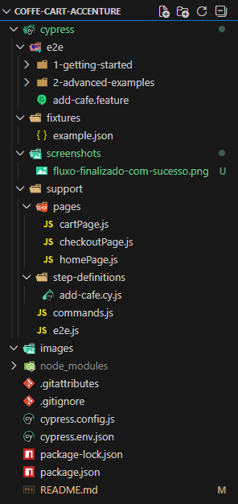
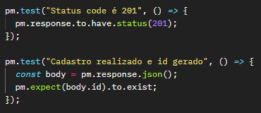

# Desafio Accenture - Coffe Cart
## Projeto

### Esse é o meu projeto de automação criado como desafio do modulo de Cypress da Academia de Testes da Accenture, cobrindo testes E2E com Cypress + Cucumber e tambem testes de API com Postman.

### A ideia principal foi validar o fluxo de compra de cafés, recusar uma oferta extra, finalizar o cadastro e no fim, simular a criação do usuário via API.

## Os testes cobrem o fluxo completo do usuário:

* ### Acessar a página inicial
* ### Adicionar 3 cafés no carrinho
* ### Validar a quantidade do carrinho
* ### Validar o valor total
* ### Recusar a oferta de café extra
* ### Acessar a página de checkout
* ### Preencher o Nome e o Emails
* ### Enviar o formulário
* ### Validar a mensagem de sucesso

## Tecnologias Utilizadas

* ### Cypress
* ### Cucumber
* ### Javascript

## Estrutura do Projeto

## Screenshots

### Além do que foi pedido no desafio, adicionei uma feature de screenshots automáticos. O Cypress já gera os prints em caso de falha, mas eu incluí também um screenshot ao final do fluxo de sucesso para deixar uma evidência visual mais completa do cenário executado, pra facilitar a validação do fluxo mesmo quando todos os testes passam corretamente.

 
 

## Testes de API com Postman

### Incluí no projeto uma collection do Postman pra simular o backend da cadastro de um usuário, já que o projeto do coffee cart é apenas front-end.
### Nessa collection é validado:

* #### Status HTTP 201

* #### Retorno de ID do usuário criado

## Os testes implementados foram:

 
 

## Configuração e Execução

* #### 1- Instalar Node.js (versão 18+)

* #### 2- Clonar o repositório:
  * git clone https://github.com/LucemyJr/coffe-cart-accenture
  * cd coffe-cart-accenture

* #### 3- Instalar as dependências:
  * npm install

* #### 4- Configurar variáveis de ambiente:
  * Criar o arquivo `cypress.env.json` na raiz do projeto
  * Preencher com os dados necessários para o fluxo de checkout (nome, email, endereço, etc.)

#### Obs: O arquivo `cypress.env.json` está listado no `.gitignore` por conter dados sensíveis e não é versionado no repositório.

* #### 5- Executar os testes E2E:
  * npx cypress open  
  **ou**
  * npx cypress run

 
 

## Observações

* #### O backend foi simulado via API pública só para fins de teste
* #### O código foi pensado para ter uma fácil leitura e reutilização

 

### Autor

* #### Nome: Lucemy Ferreira da Silveira júnior

* #### Desafio de Cypress da Academia QE Accenture -  Coffe Cart
